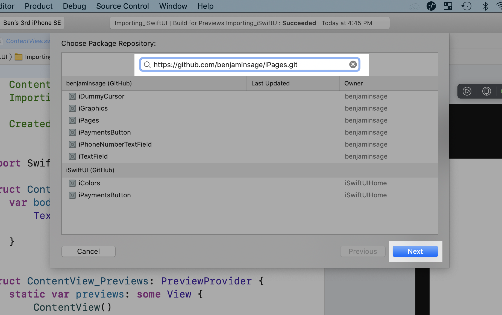
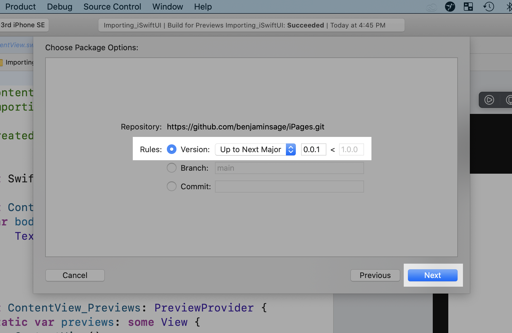

[*<<< Back to README*](https://github.com/benjaminsage/iPages)

# Instructions

## **(1/3)** Open XCode. Go to [File > Swift Packges > Add Package Dependency...]

## (2/3) Input https://github.com/benjaminsage/iPages.git & click Next.

## (3/3) Select Version: Up to Next Major & click finish.

[*<<< Back to README*](https://github.com/benjaminsage/iPages)